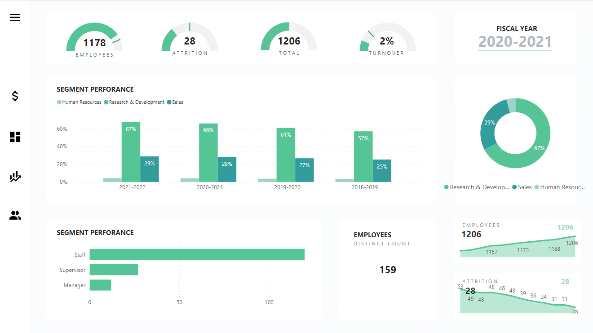
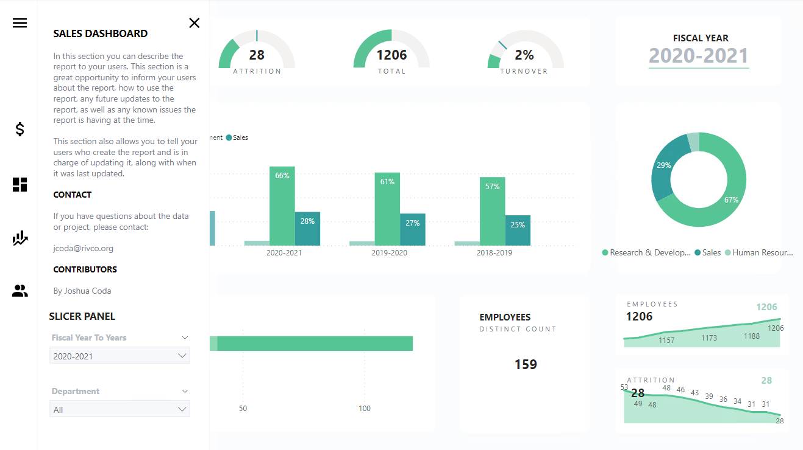
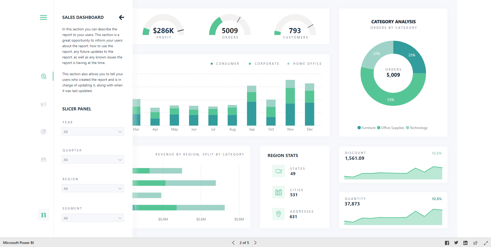
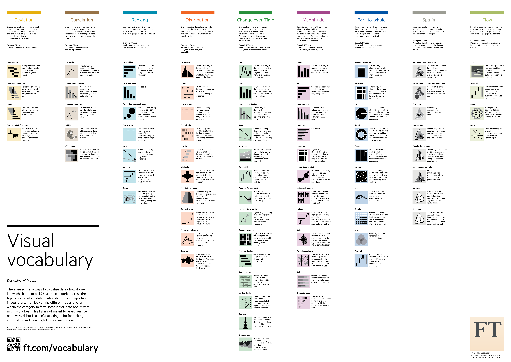

# Power BI Theme
A JSON theme provided as a theme template. 

1. Add to a Power BI file from the View tab 
2. Navigate to theme sections
3. Open Browse for themes
4. Select CORTheme1.json 

### TODO

- [x] Start a JSON theme for .pbix files
- [ ] Add logo .png files
- [x] Add .png to example
- [ ] Expand theme to include visual objects
- [ ] Provide a dark theme example
- [x] Calendar enhancement (Fiscal year, calendar year, & sort tables)

## Screenshots





## Calendar Enhancement
Basic copy paste into a Power BI Power Query Editor for ease of use or use the template in this project. One calendar table, sort (by by index) which will help your charts month year sort.

Go into Power BI Desktop and open Transform data. Create new tables with the 2 queries below. Sort columns by numeric values and connect relationship date values to calendar. Calendar date column should have a relationship with raw data. 

Date are from DateTime.LocalNow() to Date.AddYears(Date.From(DateTime.LocalNow()), -2). (3 years)

- [x] Added fiscal year map for Jun-July
- [x] Added fiscal year month sort
- [x] Added fiscal year quarter
- [x] Added fiscal year quarter sort
- [x] Added fiscal year to years (i.e. 2020-2021)
- [x] Added month sort

## Get Started
* Download the example or start a new Power BI project. 
* Open Transform data under the Home tab.

* Create a table and close
* Open Advanced Editor in the Home tab in Power Query

* Copy and paste the 2 tables below

### Power Query
1. calendar

```
let
    Quarters = {3,3,3,4,4,4,1,1,1,2,2,2},
    Period = {7,8,9,10,11,12,1,2,3,4,5,6},
    Source = List.Dates,
    #"Invoked FunctionSource" = Source(#date(Date.Year(Date.AddYears(Date.From(DateTime.LocalNow()), -4)),7,1), Duration.Days(DateTime.Date(DateTime.FixedLocalNow()) - #date(Date.Year(Date.AddYears(Date.From(DateTime.LocalNow()), -4)),7,1)), #duration(1, 0, 0, 0)),
    #"Table from List" = Table.FromList(#"Invoked FunctionSource", Splitter.SplitByNothing(), null, null, ExtraValues.Error),
    #"Added Index" = Table.AddIndexColumn(#"Table from List", "Index", 1, 1),
    #"Renamed Columns" = Table.RenameColumns(#"Added Index",{{"Column1", "Date"}}),
    #"Added Custom" = Table.AddColumn(#"Renamed Columns", "Year", each Date.Year([Date])),
    #"Added Custom1" = Table.AddColumn(#"Added Custom", "Month Number", each Date.Month([Date])),
    #"Added Custom2" = Table.AddColumn(#"Added Custom1", "Day", each Date.Day([Date])),
    #"Added Custom3" = Table.AddColumn(#"Added Custom2", "Day Name", each Date.ToText([Date],"ddd")),
    #"Added Custom4" = Table.AddColumn(#"Added Custom3", "Month Name Short", each Date.ToText([Date],"MMM")),
    #"Added Custom5" = Table.AddColumn(#"Added Custom4", "Month Name Long", each Date.ToText([Date],"MMMM")),
    #"Reordered Columns" = Table.ReorderColumns(#"Added Custom5",{"Date", "Index", "Year", "Month Number", "Month Name Short", "Month Name Long", "Day", "Day Name"}),
    #"Added Custom6" = Table.AddColumn(#"Reordered Columns", "Quarter Number", each Date.QuarterOfYear([Date])),
    #"Duplicated Column" = Table.DuplicateColumn(#"Added Custom6", "Year", "Copy of Year"),
    #"Renamed Columns1" = Table.RenameColumns(#"Duplicated Column",{{"Copy of Year", "Short Year"}}),
    #"Changed Type" = Table.TransformColumnTypes(#"Renamed Columns1",{{"Short Year", type text}}),
    #"Split Column by Position" = Table.SplitColumn(#"Changed Type","Short Year",Splitter.SplitTextByRepeatedLengths(2),{"Short Year.1", "Short Year.2"}),
    #"Changed Type1" = Table.TransformColumnTypes(#"Split Column by Position",{{"Short Year.1", Int64.Type}, {"Short Year.2", Int64.Type}}),
    #"Removed Columns" = Table.RemoveColumns(#"Changed Type1",{"Short Year.1"}),
    #"Renamed Columns2" = Table.RenameColumns(#"Removed Columns",{{"Short Year.2", "Short Year"}}),
    #"Added Custom7" = Table.AddColumn(#"Renamed Columns2", "Quarter Year", each Number.ToText([Short Year]) & "Q" & Number.ToText([Quarter Number],"00")),
    #"Reordered Columns1" = Table.ReorderColumns(#"Added Custom7",{"Index", "Date", "Day", "Day Name", "Month Number", "Month Name Short", "Month Name Long", "Quarter Number", "Quarter Year", "Short Year", "Year"}),
    #"Changed Type2" = Table.TransformColumnTypes(#"Reordered Columns1",{{"Date", type date}, {"Day", Int64.Type}, {"Index", Int64.Type}, {"Month Number", Int64.Type}, {"Quarter Number", Int64.Type}, {"Month Name Short", type text}, {"Month Name Long", type text}, {"Quarter Year", type text}, {"Year", Int64.Type}}),
    #"Added Custom8" = Table.AddColumn(#"Changed Type2", "Fiscal Year", each if Date.Month([Date])>6 then Date.Year([Date])+1 else Date.Year([Date])),
    #"Added Custom9" = Table.AddColumn(#"Added Custom8", "Fiscal Quarter", each Quarters{Date.Month([Date])-1}),
    #"Added Custom10" = Table.AddColumn(#"Added Custom9", "Fiscal Period", each Period{Date.Month([Date])-1}),
    #"Added Custom11" = Table.AddColumn(#"Added Custom10", "Fiscal Year Quarter", each Number.ToText([Fiscal Year]) & " Q" & Number.ToText([Fiscal Quarter])),
    #"Added Custom12" = Table.AddColumn(#"Added Custom11", "Fiscal Year Quarter Sort", each Number.ToText([Fiscal Year]) & "" & Number.ToText([Fiscal Quarter])),
    #"Added Custom13" = Table.AddColumn(#"Added Custom12", "Fiscal Year To Years", each Number.ToText([Fiscal Year]-1) & "-" & Number.ToText([Fiscal Year]))
in
    #"Added Custom13"
```

2. monthSort
Description: Month sort is required, because naturally order for fiscal year month order (July-June).
```
let
    Source = Table.FromRows(Json.Document(Binary.Decompress(Binary.FromText("PZC9DsIgFEbfhbmD9L+jiXEwUQdHwkAJUZPaNggmvL0f91qXc084kABKCSkKcYpT4gF2QhdKlLB9vMd3YAF7ChXs5tbgXqPz7OBArYZdbVi4wEC5o9RAL8tnOwXNTVJroQdntwbNraTW5XuZORqf2HKi0sOObvS/BAX50AA7G28fPMGK1nEXPGb1z4knWHOQtDP92fBySb8yOx5gK7T+Ag==", BinaryEncoding.Base64), Compression.Deflate)), let _t = ((type nullable text) meta [Serialized.Text = true]) in type table [Index = _t, MonthLong = _t, MonthShort = _t, MonthNumber = _t]),
    #"Changed Type" = Table.TransformColumnTypes(Source,{{"Index", Int64.Type}, {"MonthLong", type text}})
in
    #"Changed Type"
```

### Data
Go into the Data tab and sort by index for each desired field.

### Model
Connect the relationship to the main calendar table. You will use the sort tables for your charts and connect your date fields to the main calendar table.


## Resources
The theme is inspired by [this example](https://app.powerbi.com/view?r=eyJrIjoiYmU0ZjYzYmItMTE0NC00NTRiLTkwZTYtNDkzZDYwOTA5ZWI5IiwidCI6IjRiYjUwOGE5LTc1MzQtNGY0OC1iOTQxLTNkNDhlZGY5YzM3YSJ9). See Screentshot 3 for inspiriation.

The example has an expansion panel. Go [here](https://exceleratorbi.com.au/create-a-power-bi-slicer-panel/) for how to. 

Download more icons at https://materialdesignicons.com/.

Original dataset available on [Kaggle](https://www.kaggle.com/pavansubhasht/ibm-hr-analytics-attrition-dataset).

For even more resources see below:
[Visual Vocabulary](https://github.com/Financial-Times/chart-doctor/tree/main/visual-vocabulary)
[PBIX Example](http://sqljason.com/2018/12/financial-times-visual-vocabulary-power-bi-edition.html)


## Contact

If you have questions about the data or project, please contact:

jcoda@rivco.org


## Contributors

By Joshua Coda
